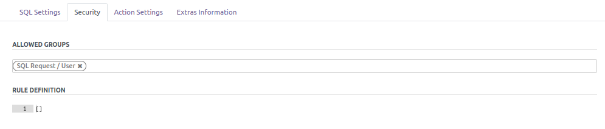
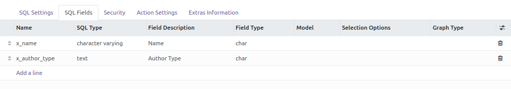
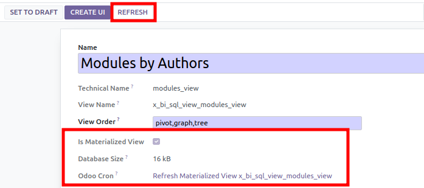

- Go to Dashboard / Configuration / SQL Views

- tip your SQL request

  

- Select the group(s) that could have access to the view

  

Optionnaly, you can add a domain.

A tipical domain in a multi company context is to write
`['|', ('company_id', '=', False), ('company_id', 'in', company_ids)]`
to make reporting depending on the current companies of the user.

- Click on the button 'Validate SQL Expression'

- Once the sql request checked, the module analyses the column of the
  view, and propose field mapping. For each field, you can decide to
  create an index and set if it will be displayed on the pivot graph as
  a column, a row or a measure.

  

- Click on the button 'Create SQL elements'. (this step could take a
  while, if view is materialized)

- If it's a MATERIALIZED view:

  > - a cron task is created to refresh the view. You can so define the
  >   frequency of the refresh.
  > - the size of view (and the indexes is displayed)

  

- Before creating the UI elements: you can modify two specific settings based
  on your needs:
  - **Parent Menu**: Apply a Parent Menu to use for when creating the UI
  elements. By default, it will be set with the `SQL Views` menu, which can be
  changed in order to have the report accessible from a different place within
  Odoo.
  - **Scheduled Action periodicity**: By going to the Settings page, you can
  customize the frequency for which you want to run the Scheduled Action that
  will refresh the Materialized view.

- Finally, click on 'Create UI', to create new menu, action, graph view
  and search view.
