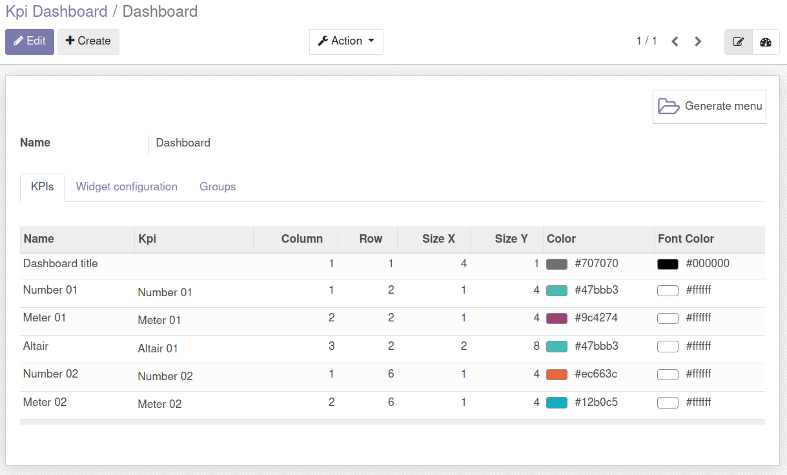

Configure KPIs
~~~~~~~~~~~~~~

#. Access `Dashboards > Configuration > KPI Dashboards > Configure KPI`
#. Create a new kpi with widget `altair`

You need to define a function like::

    import pandas
    import altair

    class Kpi(models.Model):
        _inherit = 'kpi.kpi'

        def test_demo_altair(self):
            source = pandas.DataFrame(
                {
                    "a": ["A", "B", "C", "D", "E", "F", "G", "H", "I"],
                    "b": [28, 55, 43, 91, 81, 53, 19, 87, 52],
                }
            )
            chart = altair.Chart(source).mark_bar().encode(x="a", y="b")
            return {"altair": json.loads(chart.to_json())}

You can use `code` in a similar way, as `pandas` and `altair` are already defined
when using `code` on an `altair` widget.

