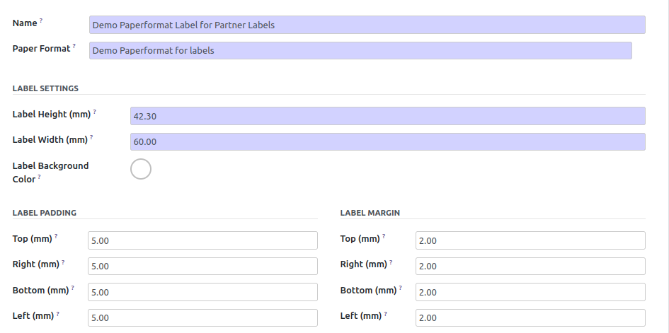

**Configure your Report Label Paperformat**

* Go to "Settings > Technical > Reporting > Label Paper Format"

* Create your self-adhesive label paper formats.

You should reuse or create a Paperformat.

**Configure your Server action**

* Go to "Settings > Technical > Actions > Server Actions"

Create your label report :

* In the 'Action to do' field, select 'Print Self-adhesive Labels'

* In the 'Label Paper Format' field, select your label paper format previously created

* In the 'Label Qweb Template' create or reuse a QWeb template for your label.

.. image:: ../static/description/ir_actions_server.png

**Importante Note**

`By design <https://github.com/OCA/reporting-engine/blob/14.0/report_label/reports/report_label.xml#L34>`_, the variable used in this QWeb template must be named `record`.
