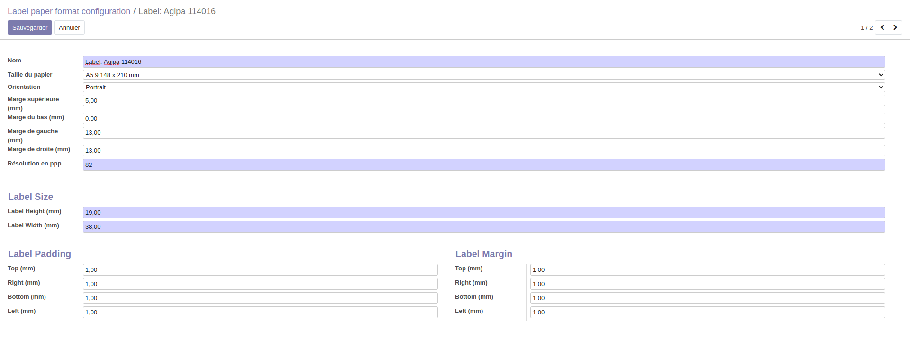

Go to **Settings > Technical > Analysis > Label Paper Format** and create
your self-adhesive label paper formats.

You'll need to create or reuse a QWeb template for you label.

`By design <https://github.com/OCA/reporting-engine/blob/14.0/report_label/reports/report_label.xml#L34>`_, the variable used in this QWeb template must be named `record`.

Go to **Settings > Technical > Analysis > Label Report** and create your label
report, and its context action.

.. image:: ../static/description/configure_report_label.png
