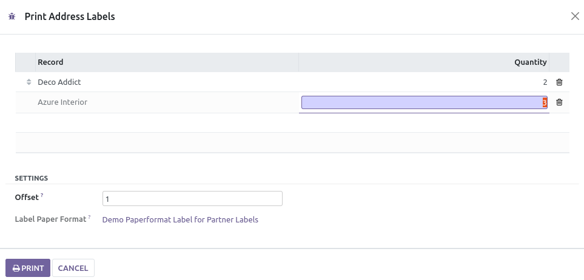
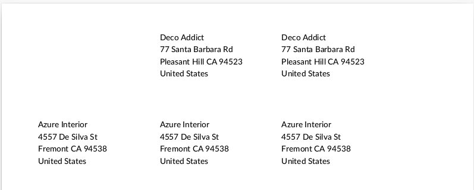

* In the target model's tree view, select the records to print.
* Click *Action* and your label report action name.
* Select the number of labels per record to print, and click Print.

you can optionaly define an offset

The items will be printed in a pdf document.

