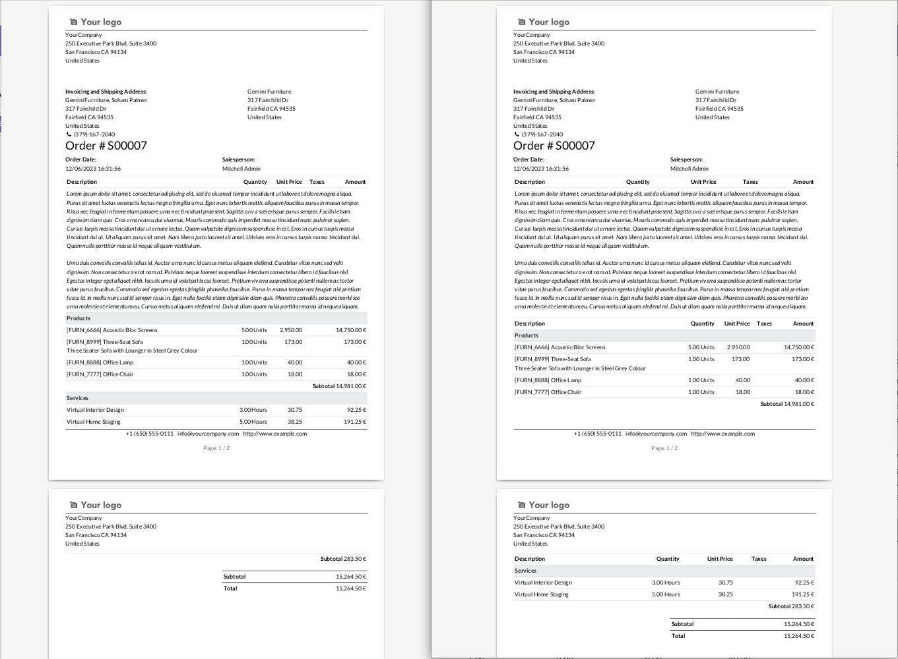

This module manipulates HTML tables in the result HTML report (just before
transforming the result to PDF by wkhtmltopdf).

It searches for any ``qweb-table-page-break`` attribute on ``<tr>`` elements.

If the value of the ``qweb-table-page-break`` attribute is one of the following
strings, the current table will be split (copying the header of the current
table) and apply the proper break page on ``<table>``'s elements:

- **before**: force breaking page before the row
- **after**: force breaking page after the row
- **avoid**: split the table and avoid breaking page inside the table as much
  as possible.

For instance, if you choose to create a new table on each new section in a sale
order line, you could overwrite the template like this::

    <template
        id="report_saleorder_document"
        inherit_id="sale.report_saleorder_document"
    >
        <xpath
            expr="//tbody[hasclass('sale_tbody')]/t/tr"
            position="attributes"
        >
            <attribute name="t-attf-qweb-table-page-break">
                {{line.display_type == 'line_section' and 'avoid' or ''}}
            </attribute>
        </xpath>
    </template>

This would create a new table for each section and add
``page-break-inside=avoid;`` style on each table. For example, in the following
example, we can see on the left, without this module Odoo splits section
before subtotal, while on the right, headers are repeated on each section, and
sections are entirely displayed on the same page:

|before_after| **Before**: Without this module on the left -- **After**: Using
this module adding ``qweb-table-page-break="avoid"`` on each section row
on the right

.. warning::

    All this magic will generate multiples ``<table>`` elements from one ``<table>``
    element in your final html document which could impact your css rules.

